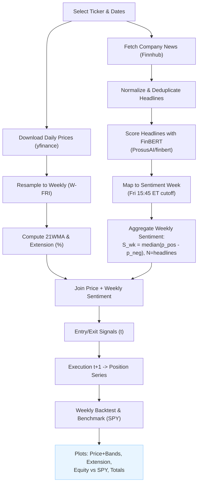

# NLP-Driven Equity Strategy: FinBERT Sentiment × 21WMA — Streamlit App & Backtests

Buy-only strategy: enter when a stock is **undervalued** (extension ≤ entry threshold vs 21-week MA) **and** weekly sentiment is **negative**; exit when **extension ≥ exit threshold** **and** weekly sentiment is **positive**. Backtests vs **SPY**.

## Features
- Weekly prices (yfinance), 21WMA, extension %
- Finnhub company news → FinBERT sentiment → weekly `S_wk = mean(p_pos - p_neg)` with min headline count
- Entry/Exit signals with Plotly charts (sentiment color bands, markers, extension panel with ±10% guides)
- Buy-only weekly backtest vs SPY (equity curves + total-return bars)
- Streamlit UI with configurable thresholds

## Quickstart (pip)
```bash
python -m venv .venv && source .venv/bin/activate   # Windows: .venv\Scripts\activate
pip install -r requirements.txt
export FINNHUB_API_KEY=YOUR_KEY
streamlit run app.py
```

## Try the strategy [HERE](https://sentiment21wmatrading-gxsxwxmxv82jukjyyxgr9v.streamlit.app)


---

## Data & Models

### Prices
- **Yahoo Finance** via `yfinance` (adjusted closes).
- Resampled to **weekly (W-FRI)** “close” and rolling **21-week MA (21WMA)**.

**Extension (%)**  

$$
\mathrm{ext}_t = \frac{\mathrm{Close}_t}{\mathrm{WMA}_{21}(t)} - 1
$$

### News
- **Finnhub Company News API** for historical headlines.
- Headlines are **deduplicated** (title+URL), normalized (lowercased, whitespace collapsed).

### Sentiment Model

- **FinBERT** (`ProsusAI/finbert`) 3-class classifier: `positive`, `neutral`, `negative`.
- We use the 🤗 Transformers pipeline; softmax probabilities give  
  $\big(p_{\mathrm{pos}},\ p_{\mathrm{neg}},\ p_{\mathrm{neu}}\big)$.

**Per-headline score**  
Inline: 

$$
s = p_{\mathrm{pos}} - p_{\mathrm{neg}} \in [-1,1]
$$

Block:

$$
s = p_{\mathrm{pos}} - p_{\mathrm{neg}} \in [-1,1]
$$

**Weekly aggregation**  
$S_{\mathrm{wk}} = \mathrm{median}\big(s\big)$, with $N$ = number of headlines in the week.

---

## Trading Logic

- **Entry signal (decision at week t):**  
  `extension ≤ ENTRY_EXT_THR` **AND** `S_wk ≤ NEG_THR` **AND** `N ≥ MIN_HEADLINES`  
  (defaults: `ENTRY_EXT_THR=-0.07`, `NEG_THR=-0.05`, `MIN_HEADLINES=3`)

- **Exit signal (decision at week t):**  
  `extension ≥ EXIT_EXT_THR` **AND** `S_wk ≥ POS_THR` **AND** `N ≥ MIN_HEADLINES`  
  (defaults: `EXIT_EXT_THR=0.12`, `POS_THR=0.05`, `MIN_HEADLINES=3`)

- **Execution timing:** decide at **t**, **apply at t+1** (avoids look-ahead).  
  Extra buys while already long (or sells while flat) are **ignored**. P&L accrues only when `position=1`.

**Backtest details**
- Weekly strategy return = `position_{t-1} * asset_return_t − costs_on_flips`
- Costs: `cost_bps` applied on each entry/exit flip.
- Equity normalized to 1.0 at start; benchmark = **SPY** buy-and-hold over same window.
- Metrics: Total Return, CAGR, Sharpe (weekly → annualized), Max Drawdown.

---

## Pipeline Diagram


